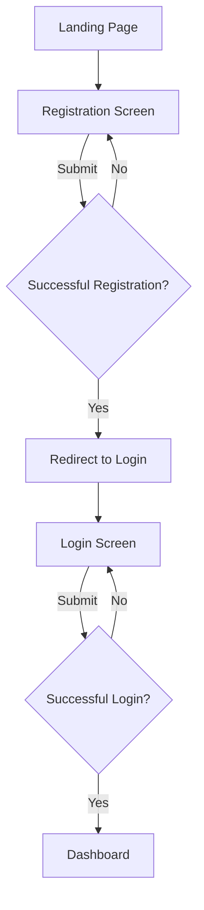
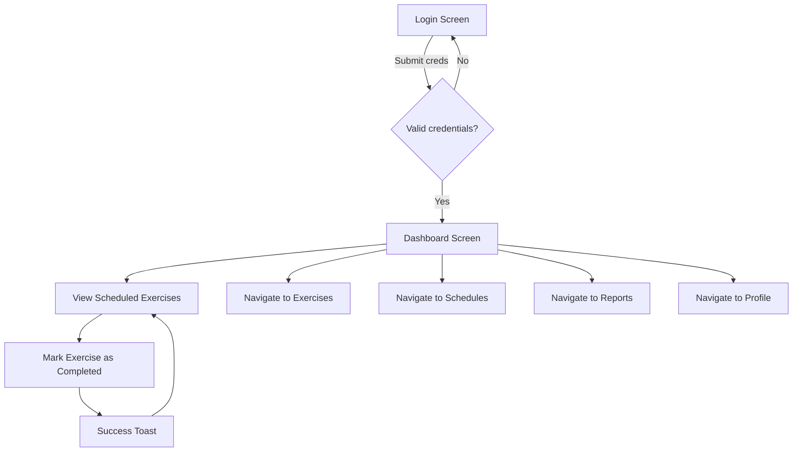
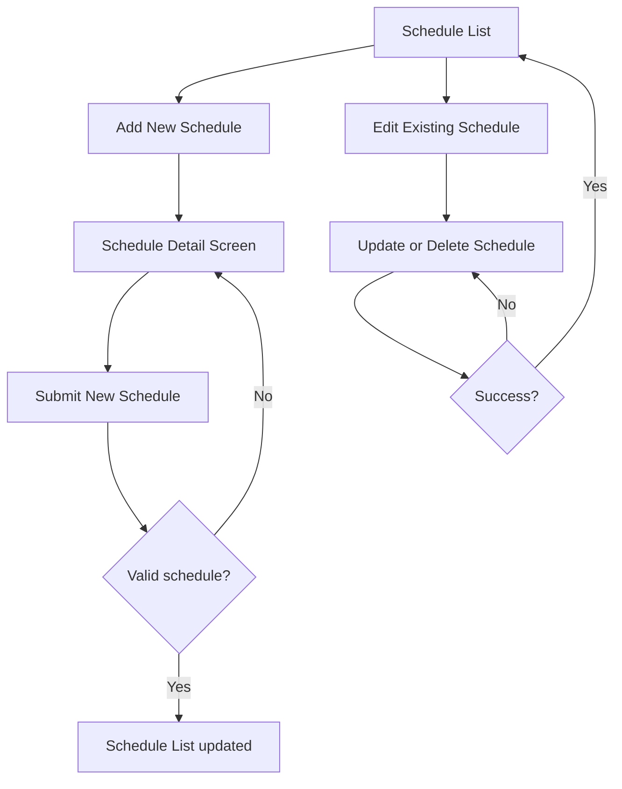
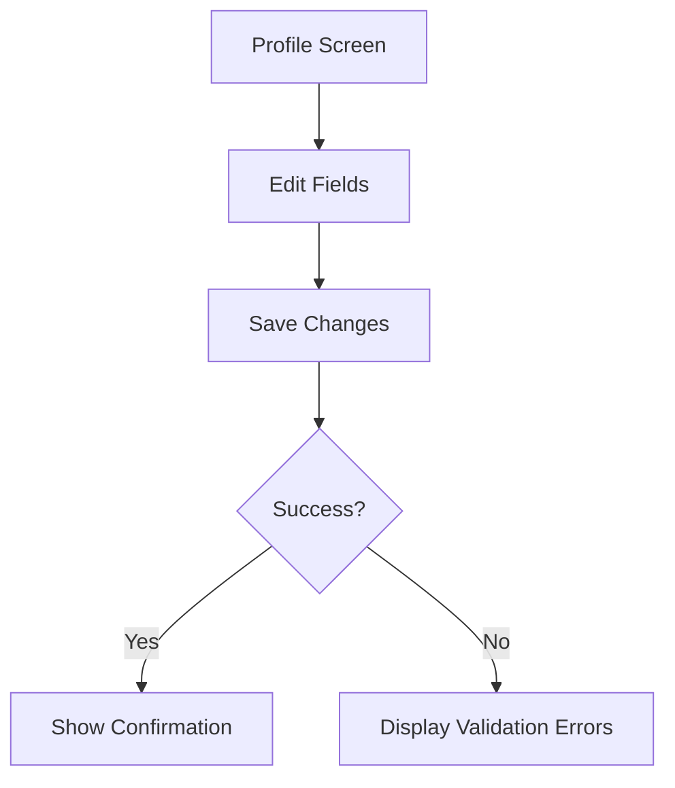

# Exercise Scheduling & Tracking Application  
**Comprehensive Frontend Design Document**

---

# 1. Application Structure

## 1.1 Main Modules

- **Authentication & User Management**  
  Registration, login, logout, profile settings, email preferences.

- **Exercise Management**  
  CRUD operations for Exercise Types.

- **Scheduling Management**  
  CRUD operations for Exercise Schedules with recurrence options.

- **Completion Tracking**  
  Mark exercises as completed, view completion history.

- **Reports & Analytics**  
  View summary reports on completed/missed exercises and completion rates.

- **Dashboard / Home**  
  Overview of today’s scheduled exercises, quick completion action.

- **Navigation / Layout**  
  Global navigation, responsive sidebar/menu.

## 1.2 Navigation Hierarchy & Menu Structure

```
Root
│
├── Authentication (Login/Registration)
│
├── Dashboard / Home
│    ├── Today's Scheduled Exercises (with completion actions)
│
├── Exercises
│    ├── Exercise Types List
│    ├── Create Exercise Type
│    └── Edit Exercise Type
│
├── Schedules
│    ├── Schedules List
│    ├── Create Schedule
│    └── Edit Schedule
│
├── Completion History
│    └── Filterable list of completed exercises
│
├── Reports
│    ├── Completed Exercises Report
│    ├── Missed Exercises Report
│    └── Completion Rate / Streak Report
│
└── User Profile
     ├── Profile Settings (timezone, email)
     └── Email Preferences
```

### Relationships Between Modules

- Exercise Types → Schedules (one-to-many)  
- Schedules → Completions (one-to-many)  
- User Profile → preferences impact Notifications & Scheduling

## 1.3 Sitemap (Tree View)

```
/login
/register
/dashboard
/exercises
  /create
  /edit/{exerciseId}
/schedules
  /create
  /edit/{scheduleId}
/completions
/reports
  /completed
  /missed
  /completion-rate
/profile
  /settings
  /email-preferences
```

---

# 2. Screen Inventory

| Screen Name             | Purpose                                               | User Roles   | Main Actions                                        | Information Displayed                                   |
|-------------------------|-------------------------------------------------------|--------------|----------------------------------------------------|---------------------------------------------------------|
| Registration Screen     | New user signup                                       | Primary User | Enter email, password, timezone, submit            | Form inputs, validation messages                         |
| Login Screen            | User authentication                                  | Primary User | Enter email/password, submit                        | Form inputs, validation messages                         |
| Dashboard / Home        | Overview of today’s scheduled exercises and quick completion marking | Primary User | View today’s schedules, mark exercises complete    | Scheduled exercise list, recurrence info, completion buttons, notifications summary |
| Exercise Types List     | List and manage exercise types                       | Primary User | View list, add/edit/delete exercises                | Exercise name, description snippets, action buttons      |
| Exercise Type Detail/Edit| Create or edit exercise type                          | Primary User | Input name, description, Save, Delete               | Form inputs with existing data if edit, validation       |
| Schedule List           | List and manage schedules                            | Primary User | View list, add/edit/delete schedules                 | Schedule details: exercise name, recurrence, start date  |
| Schedule Detail/Edit    | Create or modify schedule                            | Primary User | Select exercise type, set recurrence, start date/time, timezone | Form inputs, recurrence type/interval selectors          |
| Completion History      | Review completion log with filtering                  | Primary User | Filter by date/schedule, view completions            | Date, exercise name, completion timestamps               |
| Reports                 | View summary reports on completed/missed exercises   | Primary User | Select date ranges, report types, view charts/data  | Charts and tables of completion counts, misses, rates   |
| User Profile Settings   | Manage email, timezone, and preferences               | Primary User | Update timezone/email, set email reminders toggle   | Form inputs with current settings                        |
| Email Preferences       | Manage email reminder notifications                   | Primary User | Enable/disable email reminders                       | Email reminders toggle, explanatory text                 |

---

# 3. Detailed Screen Designs

---

### Screen Name: Registration Screen

**Purpose:** Allow new users to register an account.

**Primary user actions:**  
- Enter email, password, timezone  
- Submit registration form  

**Important data displayed:**  
- Form fields: Email, Password, Timezone selector  
- Validation feedback (e.g. invalid email, password rules, required fields)

**Wireframe:**

```
+------------------------------------------------------+
| Header: App Logo + "Register"                         |
+------------------------------------------------------+
| [Email Input]                                         |
| [Password Input]                                      |
| [Timezone Dropdown]                                   |
|                                                      |
| [Register Button]                                    |
|                                                      |
| [Link]: Already have an account? Login               |
+------------------------------------------------------+
```

**UI Components used:**  
- Text inputs (email, password)  
- Select dropdown (timezone)  
- Button  
- Validation error messages

**States:**  
- Loading: Spinner on Register button after submit  
- Error: Inline field errors + global messages on failure  
- Success: Redirect to Dashboard or Login screen

**Responsive behavior:**  
- Centered form, full width on mobile  
- Inputs stacked vertically, accessible labels  
- Touch-friendly inputs & buttons

---

### Screen Name: Login Screen

**Purpose:** Authenticate existing user.

**Primary user actions:**  
- Enter email and password  
- Submit login  
- Navigate to registration

**Important data displayed:**  
- Email, Password inputs  
- Validation errors  
- Forgot Password link (if future enhancement)

**Wireframe:**

```
+------------------------------------------------------+
| Header: App Logo + "Login"                            |
+------------------------------------------------------+
| [Email Input]                                         |
| [Password Input]                                      |
|                                                      |
| [Login Button]                                       |
|                                                      |
| [Link]: Don't have an account? Register              |
+------------------------------------------------------+
```

**UI Components & States:** Same as Registration Screen

---

### Screen Name: Dashboard / Home Screen

**Purpose:** Provide summary of today’s scheduled exercises and easy completion marking.

**Primary user actions:**  
- View today’s exercises with recurrence info  
- Mark exercises as completed (single click/button)  
- Navigate to Exercises, Schedules, Reports, Profile

**Important data displayed:**  
- List of scheduled exercises for today (including recurrence details)  
- Completion status for each exercise today (e.g., completed/not completed)  
- Upcoming reminders summary or alerts  
- Navigation menu/sidebar

**Wireframe:**

```
+------------------------------------------------------+
| Header: Logo | App Name | User Menu/Profile          |
+------------------------------------------------------+
| Sidebar          | Main Content                       |
|                  | +---------------------------------+
| [Menu]           | | Today's Scheduled Exercises     |
| - Dashboard      | |---------------------------------|
| - Exercises      | | 1. Running - Daily @ 7:00 AM    |
| - Schedules      | |    [Mark as Completed] [Completed ✅] |
| - Completions    | | 2. Yoga - Weekly (Mon, Wed)     |
| - Reports        | |    [Mark as Completed] [Pending]|
| - Profile        | +---------------------------------+
+------------------------------------------------------+
```

**UI Components:**  
- Sidebar Navigation  
- Data List (scheduled exercises)  
- Buttons (Mark as Completed)  
- Status indicators (icons/badges)  
- Notifications panel (optional)  

**Empty state:**  
- "No scheduled exercises for today. Create a new schedule." with call-to-action button.

**Loading state:**  
- Skeleton or spinner in the exercises list area.

**Error state:**  
- Inline message in list area, "Failed to load schedules."

**Success feedback:**  
- Snackbar/toast "Exercise marked as completed."

**Responsive behavior:**  
- Sidebar collapses to hamburger menu on narrow screens  
- List stacks vertically, buttons full width on mobile

---

### Screen Name: Exercises List Screen

**Purpose:** List all exercise types owned by user; manage (create/edit/delete).

**Primary user actions:**  
- View exercise types summary  
- Navigate to create new exercise  
- Edit or delete existing exercises

**Important data displayed:**  
- Exercise Name  
- Description snippet (optional)  
- Created/updated date (optional)  

**Wireframe:**

```
+------------------------------------------------------+
| Header and Sidebar (as in Dashboard)                  |
+------------------------------------------------------+
| Main Content                                         |
| +--------------------------------------------------+|
| | Exercises                                        | |
| | + [Add New Exercise Type]                        | |
| |-------------------------------------------------| |
| | [Running]       Description snippet...          | |
| |    [Edit]  [Delete]                             | |
| | [Yoga]          Description snippet...          | |
| |    [Edit]  [Delete]                             | |
| | ...                                             | |
| +------------------------------------------------+ |
+------------------------------------------------------+
```

**UI Components:**  
- Data Table or Card List with actions  
- Modal/Drawer or separate screens for create/edit

**Empty state:**  
- "No exercises found. Create your first exercise type."

**Loading/error/success feedback:**  
- Spinner in list during loading  
- Confirmation dialog on delete  
- Toast on successful add/update/delete

**Responsive behavior:**  
- Table converts to vertical card list on small screens  
- Action buttons stacked or icon-only with tooltips

---

### Screen Name: Exercise Detail / Edit Screen

**Purpose:** Create or edit the exercise type.

**Primary user actions:**  
- Input name  
- Input optional description  
- Save or delete (delete only for edit)  
- Cancel/Back  

**Important data displayed:**  
- Form fields: Name (required), Description (optional)  

**Wireframe:**

```
+------------------------------------------------------+
| Header and Sidebar                                   |
+------------------------------------------------------+
| Main Content                                         |
| Form:                                                |
|  - Name: [_____________]                             |
|  - Description: [___________________________]       |
|                                                      |
| [Save] [Cancel]       [Delete (if editing)]         |
+------------------------------------------------------+
```

**UI Components:**  
- Form inputs (text, textarea)  
- Buttons  
- Validation messages  

**Empty state:** N/A  
**Loading state:** Loading spinner if existing data is fetched  
**Error state:** Inline validation errors  
**Success feedback:** Toast on save success  

**Responsive behavior:** Full width form on mobile  

---

### Screen Name: Schedules List Screen

**Purpose:** View all exercise schedules; manage schedules.

**Primary user actions:**  
- View schedules with exercise name and recurrence details  
- Add/edit/delete schedules  

**Important data displayed:**  
- Exercise Type name  
- Recurrence Type and Interval (e.g., "Every 2 days")  
- Start Datetime  
- Timezone  

**Wireframe:**

```
+------------------------------------------------------+
| Header and Sidebar                                   |
+------------------------------------------------------+
| Main Content                                       |
| +------------------------------------------------+ |
| | Exercise Schedules                              | |
| | + [Add New Schedule]                           | |
| |------------------------------------------------| |
| | Running - Daily, every 1 day, starts 2024-01-01| |
| |     [Edit] [Delete]                            | |
| | Yoga - Weekly, every 1 week                    | |
| |     [Edit] [Delete]                            | |
| | ...                                            | |
| +------------------------------------------------+ |
+------------------------------------------------------+
```

**UI Components:** Similar to Exercises List  
**States:** Empty, loading, error, success feedback  
**Responsive:** Similar to Exercises List  

---

### Screen Name: Schedule Detail / Edit Screen

**Purpose:** Add or modify recurring exercise schedule.

**Primary user actions:**  
- Select exercise type (dropdown/search)  
- Select recurrence type (radio or dropdown: Hourly, Daily, Weekly)  
- Input recurrence interval (number input > 0)  
- Select start datetime with timezone  
- Save or cancel  

**Wireframe:**

```
+------------------------------------------------------+
| Header and Sidebar                                   |
+------------------------------------------------------+
| Form:                                                |
|  - Exercise Type: [Dropdown/Search]                 |
|  - Recurrence Type: ( ) Hourly ( ) Daily ( ) Weekly |
|  - Recurrence Interval: [___] (e.g. every N hours)  |
|  - Start Date & Time: [Date Picker] [Time Picker]   |
|  - Timezone: [Dropdown - default user tz]           |
|                                                      |
| [Save] [Cancel]                                      |
+------------------------------------------------------+
```

**UI Components:**  
- Dropdown/search exercise type  
- Radio buttons / select for recurrence type  
- Number input for interval with validation  
- Date-Time pickers with timezone awareness  
- Buttons  

**Empty, loading, and error states:**  
- Validation inline messages for invalid data  
- Loading on initial data fetch if editing  

**Responsive:** Form stacks vertically on narrow screens  

---

### Screen Name: Completion History Screen

**Purpose:** Display historical records of completed exercises; filterable.

**Primary user actions:**  
- Filter by date range  
- Filter by schedule or exercise type (optional)  
- View completion entries  
- Possibly delete/correct completions (optional)  

**Information displayed:**  
- Date/time of completion  
- Exercise name  
- Schedule info  

**Wireframe:**

```
+------------------------------------------------------+
| Header and Sidebar                                   |
+------------------------------------------------------+
| Filters:                                            |
|  - Date Range: [Start Date] to [End Date]          |
|  - Exercise Type/Schedule (optional)                |
|                                                      |
| Completion Records:                                  |
| +------------------------------------------------+ |
| | 2024-02-01 07:00 AM | Running                   | |
| | 2024-02-02 08:30 AM | Yoga                      | |
| | ...                                               | |
| +------------------------------------------------+ |
+------------------------------------------------------+
```

**UI Components:**  
- Date range picker  
- Select dropdown for filters  
- Data table or list with pagination if needed  

**States:** loading spinner, no data empty state, error message  
**Responsive:** Makes filter controls and list stack on small devices  

---

### Screen Name: Reports Screen

**Purpose:** View summary reports including completions, misses, and completion rates.

**Primary user actions:**  
- Select report type (Completion counts, Missed exercises, Completion rates)  
- Select date range  
- View graphical summary and data  

**Information displayed:**  
- Bar charts, line charts, percentages  
- Data tables summarizing results  

**Wireframe:**

```
+------------------------------------------------------+
| Header and Sidebar                                   |
+------------------------------------------------------+
| Controls:                                           |
| - Report Type: [Dropdown]                           |
| - Date Range: [Start Date] to [End Date]           |
|                                                      |
| Report Display:                                    |
| +------------------------------------------------+ |
| | [Chart or Table based on report type]          | |
| | - Completed Exercises (daily/weekly/monthly)   | |
| | - Missed Exercises Count                         | |
| | - Completion Rate and Streak                      | |
| +------------------------------------------------+ |
+------------------------------------------------------+
```

**UI Components:**  
- Dropdown/select for report type  
- Date pickers  
- Charting components (bar/line charts)  
- Tables (optional)  

**States:** empty data message, loading spinner, error message  
**Responsive:** Responsive charts and stacked controls on mobile  

---

### Screen Name: User Profile Settings Screen

**Purpose:** Manage email, timezone, and email reminder preferences.

**Primary user actions:**  
- Change email (optional)  
- Change timezone  
- Toggle email reminders on/off  
- Save changes  

**Information displayed:**  
- Current email  
- Timezone selector  
- Email reminders toggle  

**Wireframe:**

```
+------------------------------------------------------+
| Header and Sidebar                                   |
+------------------------------------------------------+
| Form:                                                |
|  - Email: [_____________]                            |
|  - Timezone: [Dropdown]                              |
|  - Email Reminders: [Toggle Switch]                  |
|                                                      |
| [Save Changes]                                       |
+------------------------------------------------------+
```

**UI Components:**  
- Text input (email)  
- Select dropdown (timezone)  
- Toggle switch (email reminders)  
- Button  

**States:** validation errors, loading, success toast  
**Responsive:** stacked form fields, full-width inputs on narrow viewports  

---

# 4. Navigation Flows

---

### 4.1 User Registration Flow



---

### 4.2 Login and Dashboard Access Flow



---

### 4.3 Exercise Management Flow

```mermaid
flowchart TD
  A[Exercise List Screen] --> B[Click "Add Exercise"]
  B --> C[Exercise Detail Screen (Create)]
  C --> D[Submit Form]
  D --> E{Validation OK?}
  E -->|Yes| F[Exercise List Screen with new entry]
  E -->|No| C
  A --> G[Select Exercise]
  G --> H[Exercise Detail Screen (Edit)]
  H --> I[Update or Delete Exercise]
  I --> J{Action Success?}
  J -->|Yes| A
  J -->|No| H
```

---

### 4.4 Scheduling Flow



---

### 4.5 Completion Tracking Flow

```mermaid
flowchart TD
  A[Dashboard / Schedule List] --> B[Click "Mark as Completed"]
  B --> C[POST completion API]
  C --> D{Success?}
  D -->|Yes| E[Show Toast, update UI]
  D -->|No| F[Show error message]
```

---

### 4.6 Reports Viewing Flow

```mermaid
flowchart TD
  A[Reports Screen] --> B[Select Report Type]
  B --> C[Select Date Range]
  C --> D[Fetch Report Data]
  D --> E{Data returned?}
  E -->|Yes| F[Render Chart/Table]
  E -->|No| G[Show "No Data" Message]
```

---

### 4.7 User Profile & Email Preferences Flow



---

# 5. Reusable Components

| Component             | Usage Locations                                          |
|-----------------------|----------------------------------------------------------|
| Data Table            | Exercise Types List, Schedules List, Completion History, Reports tables |
| Form Inputs           | All screens requiring data entry (exercises, schedules, profile) |
| Date Picker           | Schedule start datetime, filters in completions and reports |
| Time Picker           | Schedule start time                                    |
| Dropdown / Select     | Timezones, recurrence type, exercise type selectors       |
| Buttons               | Submit forms, add/edit/delete actions                      |
| Modal Dialogs         | Confirm deletion of exercises, schedules, completions     |
| Notification Snackbar | Feedback on success/error actions                         |
| Sidebar Navigation    | Main app navigation                                        |
| Header Bar            | Persistent header with user menu, logout                  |
| Toggle Switch         | Email reminders preference                                 |
| Chart Components      | Reports screen (bar, line charts)                          |
| Search Input          | Exercise type search when selecting in schedules           |
| Loading Skeleton / Spinner | Indicate loading states across screens                  |
| Error Message Panel   | API/network error display                                  |

---

# 6. Design System Recommendations

## Typography Hierarchy

- **H1:** 32px / Bold (App Name, major page headers e.g. Dashboard)  
- **H2:** 24px / Semi-bold (Section headers e.g. Exercises List)  
- **H3:** 18px / Medium (Subsections within pages)  
- **Body Text:** 14-16px / Regular (Form labels, list items)  
- **Small text:** 12px / Regular or Italic (Timestamps, descriptions)  

## Layout & Spacing

- Grid with 12 columns for desktop  
- Responsive breakpoints at 1200px, 900px, 600px, 400px  
- Margin and padding 16px base, scaled by multiples (8px increments)  
- Consistent gutter spacing between elements (16-24px)  

## Grid System

- Container max-width: 1200px  
- Sidebar width: 240px (collapsible to 60px icon-only on mobile)  
- Content padding: 16px horizontal / vertical  
- Control widths adaptive: Full width on mobile, fixed widths on desktop  

## Form Patterns

- Label above inputs  
- Inline validation messages below inputs in red  
- Disabled states clearly visible  
- Clear buttons for clearing inputs when relevant  
- Accessible with keyboard and screen readers  

## Table Patterns

- Column sorting on headers where applicable  
- Pagination or infinite scroll for long lists  
- Row hover and selection highlights  
- Responsive: tables become card lists or stacked blocks on small screens  

## Color Usage

- Primary color for buttons, links, active navigation items (e.g., blue)  
- Semantic colors:  
  - Success (green)  
  - Warning (orange)  
  - Error (red)  
- Neutral greys for backgrounds, borders, disabled states  
- Use high contrast for accessibility compliance (WCAG AA at minimum)  

## Dark Mode Considerations

- Use CSS variables for colors for easy theme switching  
- Ensure all components adapt with sufficient contrast for dark backgrounds  
- Avoid pure black (#000000), use dark greys for backgrounds  
- Test charts and UI elements for readability on dark backgrounds  

---

# 7. Screen Dependency Matrix

| Screen                  | Depends On                  | Navigation Source                | Navigation Destination           |
|-------------------------|-----------------------------|---------------------------------|---------------------------------|
| Registration Screen      | None                        | Landing page / direct URL       | Login Screen                    |
| Login Screen             | None                        | Landing page / direct URL       | Dashboard                      |
| Dashboard / Home        | Schedules, Completions     | Login Screen                   | Exercises List, Schedules List, Reports, Profile |
| Exercises List          | None                        | Dashboard, Sidebar             | Exercise Detail/Edit           |
| Exercise Detail/Edit    | Exercises List               | Exercises List                 | Exercises List, Dashboard      |
| Schedules List          | Exercises List               | Dashboard, Sidebar             | Schedule Detail/Edit           |
| Schedule Detail/Edit    | Schedules List, Exercises List | Schedules List               | Schedules List, Dashboard      |
| Completion History      | Completions                 | Dashboard, Sidebar             | None                         |
| Reports                  | Completions, Schedules      | Dashboard, Sidebar             | None                         |
| User Profile Settings   | User Data                   | Dashboard, Sidebar             | Dashboard                     |
| Email Preferences       | User Data                   | User Profile Settings          | User Profile Settings          |

---

# 8. Frontend Development Priority Plan

| Priority Step              | Items Included                                         | Justification                                                                               |
|----------------------------|-------------------------------------------------------|---------------------------------------------------------------------------------------------|
| **1. Layouts**             | Global layout (header, sidebar, responsive containers) | Foundation for all screens; enables rapid scaffolding of pages.                             |
| **2. Shared Components**    | Buttons, inputs, modals, toggles, data tables, date/time pickers, notifications | Core UI building blocks reused across many screens ensure consistency and reduce redundancy. |
| **3. Feature Components**   | Exercise List Card, Schedule List Card, Completion List, Report Charts/Reports Panels | Modular features implementing domain logic, once UI blocks ready.                          |
| **4. Pages/Screens**        | Authentication, Dashboard, Exercises, Schedules, Completion History, Reports, Profile | Assemble features and components into full user flows and navigable screens.                |

**Justification:**  
- Starting with layouts ensures responsive scaffolding and base navigation patterns.  
- Developing shared components next creates a UI toolkit for the app, fostering interface consistency and reducing rework.  
- Feature components focus on domain-specific UI that depends upon those reusable components.  
- Finally, pages assemble everything into coherent screens for the user journey.

---

# Summary

This document outlines a complete frontend design and UX reference for the Exercise Scheduling & Tracking Application, supporting the MVP functional scope defined by provided requirements and backend design artifacts. It emphasizes a modern, responsive, accessible enterprise-grade web app design with optimized user workflows and reusable UI components to speed up implementation.

Please advise if you require clickable prototypes, detailed interaction specs, or multi-device wireframes.

---