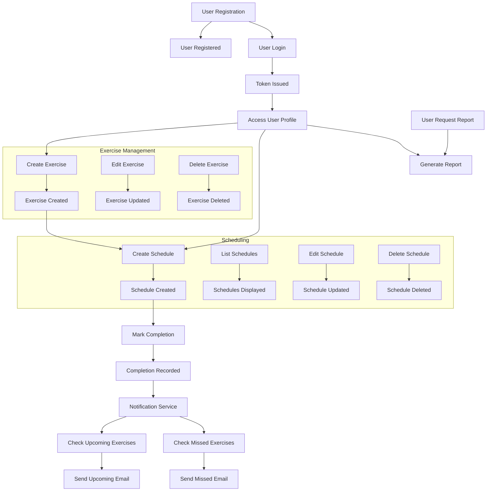

## 1. Application Summary

**What the application does:**

A personalized exercise scheduling and tracking platform that enables users to create exercise types, schedule recurring exercises with daily/weekly intervals, mark exercises as completed, receive email reminders (for upcoming and missed exercises), and generate simple progress reports to monitor exercise compliance and trends.

**Who uses it:**

Primary Users — individuals who want to organize and manage their own exercise routines and track their workout adherence. No multi-user or collaborative use in MVP.

**Core business objectives:**

- Support flexible recurring exercise schedules manageable by each user individually.
- Enhance user compliance via timely email reminders for upcoming and missed workouts.
- Enable accurate tracking of exercise completion history.
- Provide simple analytics reports (completion counts, misses, completion rates).
- Securely manage user profiles, authentication, and preferences with support for timezone-awareness.

---

## 2. User Roles

| Role          | Responsibilities                                                                                  | Permissions                                                                                        | Accessible Features                                  | Typical Tasks                                            |
|---------------|-------------------------------------------------------------------------------------------------|---------------------------------------------------------------------------------------------------|-----------------------------------------------------|----------------------------------------------------------|
| Primary User  | Create/edit/delete exercise types and schedules; mark exercise completions; receive reminders; view reports; manage profile and email preferences. | Full access to own data: CRUD on exercise types and schedules, mark completions, view reports, update profile and preferences. No access to other users' data. | Exercise management, scheduling interface, completion marking, report viewing, profile and email preferences management. | Create exercises, schedule workouts, receive and respond to reminders, mark completion, analyze progress reports, update profile settings.|

---

## 3. Entity Analysis

### 1. User

- **Purpose:** Represents an application user; manages authentication, profile preferences, and email notification settings.
- **Attributes:** 
  - id (UUID, PK)
  - email (unique, required)
  - password_hash
  - timezone (IANA tz string)
  - email_reminders_enabled (boolean)
  - created_at
  - updated_at
- **Relationships:** 
  - One-to-many Exercises (ExerciseTypes)
  - One-to-many ExerciseSchedules
  - One-to-many EmailNotifications
- **Lifecycle States:**
  - Created (upon registration)
  - Active (after email verification - assumed)
  - Updated (profile changes)
  - Disabled/Deleted (not explicitly stated)

---

### 2. ExerciseType

- **Purpose:** Categorize user exercises (e.g., running, yoga).
- **Attributes:** 
  - id (UUID, PK)
  - user_id (FK)
  - name (unique per user)
  - description (optional)
  - created_at
  - updated_at
- **Relationships:** 
  - Many-to-one User
  - One-to-many ExerciseSchedules
- **Lifecycle States:**
  - Created
  - Updated
  - Deleted

---

### 3. ExerciseSchedule

- **Purpose:** Define recurring scheduled workouts linked to an ExerciseType, with recurrence rules.
- **Attributes:** 
  - id (UUID, PK)
  - user_id (FK)
  - exercise_type_id (FK)
  - recurrence_type (enum: DAILY, WEEKLY)
  - recurrence_interval (integer > 0)
  - start_datetime (timestamp with tz)
  - timezone (string)
  - created_at
  - updated_at
- **Relationships:** 
  - Many-to-one User
  - Many-to-one ExerciseType
  - One-to-many ExerciseCompletions
  - One-to-many EmailNotifications
- **Lifecycle States:**
  - Created
  - Updated
  - Deleted

---

### 4. ExerciseCompletion

- **Purpose:** Record of an instance when a scheduled exercise was completed.
- **Attributes:** 
  - id (UUID, PK)
  - schedule_id (FK)
  - completion_datetime (timestamp with tz)
  - created_at
- **Relationships:** 
  - Many-to-one ExerciseSchedule
- **Lifecycle States:**
  - Created (when user marks completion)
  - Optional: Deleted (for corrections, optional API exists)

---

### 5. EmailNotification

- **Purpose:** Log of sent email reminders (upcoming or missed) for audit and duplication prevention.
- **Attributes:** 
  - id (UUID, PK)
  - user_id (FK)
  - schedule_id (FK)
  - notification_type (enum: UPCOMING, MISSED)
  - sent_timestamp
  - email_status (SENT, FAILED)
- **Relationships:** 
  - Many-to-one User
  - Many-to-one ExerciseSchedule
- **Lifecycle States:**
  - Created (when email sent)
  - Updated (status update on failure)

---

## 4. Workflow Discovery

### Workflow 1: User Registration and Authentication

**Purpose:** Enable a new user to register, authenticate, and manage session.

**Actors:** Primary User

**Preconditions:** None; user accessing the system.

**Trigger:** User submits registration or login form.

**Steps:**

1. User registers providing email, password, and timezone.
2. System validates inputs, hashes password, and creates User record.
3. System may send verification email (assumed).
4. User logs in with credentials.
5. System validates and issues JWT access token.
6. User accesses protected resources with token.
7. User can logout, invalidating session/token.

**Success outcome:** User gains authenticated session, personalized data access.

**Failure scenarios:** Invalid credentials, unverified email (assumed), locked account, rate limiting.

**Business rules:**
- Emails unique and validated.
- Passwords min length enforced.
- Secure tokens issued on login.
- Users only access own data.

**Related entities:** User

**Related APIs:** POST /auth/register, POST /auth/login, POST /auth/logout, GET /users/me

---

### Workflow 2: Exercise Type Management

**Purpose:** Allow users to create, edit, list, and delete exercise types.

**Actors:** Primary User

**Preconditions:** Authenticated user.

**Trigger:** User requests to manage exercise types.

**Steps:**

1. User submits form to create new exercise type.
2. System validates name uniqueness per user.
3. System stores new ExerciseType linked to user.
4. User retrieves list of exercise types.
5. User updates or deletes an existing exercise type.
6. System enforces ownership and cascades deletes (deleting associated schedules).

**Success outcome:** Exercises managed and organized by user.

**Failure scenarios:** Duplicate exercise names, unauthorized edits, cascade failures.

**Business rules:**
- Exercise name unique per user.
- Deletion cascades to schedules.

**Related entities:** ExerciseType, User, ExerciseSchedule

**Related APIs:** POST /exercises, GET /exercises, PUT /exercises/{id}, DELETE /exercises/{id}

---

### Workflow 3: Schedule Creation and Management

**Purpose:** Enable users to create recurring exercise schedules with recurrence rules.

**Actors:** Primary User

**Preconditions:** Authenticated user with existing ExerciseTypes.

**Trigger:** User creates/updates/deletes schedules.

**Steps:**

1. User selects ExerciseType, recurrence type (daily/weekly), interval, start datetime, and timezone.
2. System validates inputs, persistence of schedule.
3. User retrieves list of schedules with recurrence details.
4. User can update or delete schedules (ownership enforced).

**Success outcome:** Accurate recurring workout schedules saved for user.

**Failure scenarios:** Invalid recurrence interval, unauthorized access, schedule deletion with existing dependencies.

**Business rules:**
- Recurrence interval > 0.
- Timezone validation.
- Schedules belong to exercise types owned by user.

**Related entities:** ExerciseSchedule, ExerciseType, User

**Related APIs:** POST /schedules, GET /schedules, PUT /schedules/{id}, DELETE /schedules/{id}

---

### Workflow 4: Exercise Completion Tracking

**Purpose:** Record when the user completes a scheduled exercise.

**Actors:** Primary User

**Preconditions:** Authenticated user with existing schedules.

**Trigger:** User marks exercise as completed.

**Steps:**

1. User selects a schedule instance and marks as completed.
2. System records completion with timestamp (either provided or now).
3. User can list completions for history or correction.

**Success outcome:** User's exercise activity tracked for reporting.

**Failure scenarios:** Duplicate completion for same scheduled instance (business rules unclear), unauthorized access, invalid schedule id.

**Business rules:**
- Completions linked to user’s schedules.
- Possibly prevent duplicate completions for same instance (not mandatory).

**Related entities:** ExerciseCompletion, ExerciseSchedule

**Related APIs:** POST /completions, GET /completions, DELETE /completions/{id}

---

### Workflow 5: Email Reminder Notifications

**Purpose:** Automatically send email reminders for upcoming and missed exercises.

**Actors:** System (Notification Service), Primary User (recipient)

**Preconditions:** User has enabled email reminders and configured valid email.

**Trigger:** Background job runs periodically (cron/event-driven).

**Steps:**

1. Notification service queries schedules and completions to identify:
   - Upcoming exercises due soon.
   - Missed exercises overdue and uncompleted.
2. Check user preferences for reminders.
3. Send emails via external Email Service.
4. Log notifications in EmailNotifications table to avoid duplicates.
5. Update notification status on success or failure.

**Success outcome:** Timely reminder emails received by user, logged for auditing.

**Failure scenarios:** Email sending failure, service downtime.

**Business rules:**
- Only notify for exercises owned by user.
- No duplicate notifications for same schedule event.
- Obey user email preference setting.

**Related entities:** EmailNotification, ExerciseSchedule, ExerciseCompletion, User

**Related APIs:** None (internal service)

---

### Workflow 6: Reporting on Exercise Activity

**Purpose:** Provide users with basic reports of completed and missed exercises, including completion rates and streaks.

**Actors:** Primary User

**Preconditions:** Authenticated user with exercise completion data.

**Trigger:** User requests report via UI.

**Steps:**

1. User requests report specifying date range and report type.
2. Reporting engine queries completions, schedules, notifications.
3. Aggregates counts of completions and missed exercises.
4. Calculates completion rate and active streak.
5. Returns report data for display.

**Success outcome:** Accurate and timely reports provided to user.

**Failure scenarios:** No data for period, invalid dates.

**Business rules:**
- Date range must be valid.
- Reports scoped to the requesting user.

**Related entities:** ExerciseCompletion, ExerciseSchedule, EmailNotification

**Related APIs:** GET /reports/completions, GET /reports/missed, GET /reports/completion-rate

---

### Workflow 7: User Profile and Email Preferences Management

**Purpose:** Users manage personal settings such as timezone and email notification preferences.

**Actors:** Primary User

**Preconditions:** Authenticated user.

**Trigger:** User updates profile or email reminder settings.

**Steps:**

1. User retrieves profile.
2. User updates timezone, email, or email reminders enabled flag.
3. System validates and saves updates.

**Success outcome:** User preferences persist for accurate scheduling and notifications.

**Failure scenarios:** Invalid timezone strings or email format.

**Business rules:**
- Timezone must be valid IANA identifier.
- Email reminders respect flag settings.

**Related entities:** User

**Related APIs:** GET /users/me, PUT /users/me/profile, PUT /users/me/email-preferences

---

## 5. User Journeys

### Primary User

#### Daily Activities

- Login with email and password.
- Review scheduled exercises with recurrence details.
- Mark exercises as completed after performing.
- Receive and read email reminders.
- Occasionally create or edit exercise types and schedules.
- View progress reports to monitor completion rates and missed exercises.
- Update email preferences or timezone settings as needed.

#### Most Common Tasks

- Mark exercise as completed.
- View today's scheduled exercises.
- Receive upcoming exercise email reminders.
- Check reports weekly or monthly.
- Add or edit an exercise or schedule occasionally.

#### Navigation Patterns

- Login > Dashboard (summary of scheduled exercises and pending completions)
- Navigate to Exercises list (view/manage)
- Navigate to Schedules list (view/manage)
- Mark completions via dashboard or schedule detail screen
- View reports section
- Access user profile for preferences update

#### Typical Sequence of Actions

1. Log in.
2. Check scheduled exercises.
3. Perform exercise.
4. Mark completion.
5. Review email notifications or report.
6. Adjust schedule or exercises if needed.
7. Log out or continue.

#### Pain Points (assumed)

- No multi-user collaboration.
- Limited recurrence options.
- Manual completion marking might lead to forgetting to mark.
- Email only for reminders (no mobile push).

---

## 6. Workflow Diagrams

---

## 7. Screen Discovery

| Screen Name               | Purpose                                      | Primary Actor | Main Actions                                    | Related APIs                         | Related Entities            |
|---------------------------|----------------------------------------------|---------------|------------------------------------------------|-------------------------------------|----------------------------|
| Registration Screen       | Register new user                             | Primary User  | Input email, password, timezone, submit        | POST /auth/register                 | User                       |
| Login Screen              | Authenticate user                            | Primary User  | Input credentials, submit                       | POST /auth/login                   | User                       |
| Dashboard/Home Screen     | Overview of schedules and todays exercises  | Primary User  | View schedules, upcoming exercises, mark completion | GET /schedules, POST /completions  | ExerciseSchedule, ExerciseCompletion |
| Exercise Types List       | List all exercise types                      | Primary User  | View list, add/edit/delete exercises            | GET /exercises, POST/PUT/DELETE /exercises/{id} | ExerciseType               |
| Exercise Type Detail/Edit | View or edit an exercise type                | Primary User  | Update/delete exercise                           | GET/PUT/DELETE /exercises/{id}      | ExerciseType               |
| Schedule List             | List user’s schedules                         | Primary User  | View, add/edit/delete schedules                  | GET /schedules, POST/PUT/DELETE /schedules/{id} | ExerciseSchedule           |
| Schedule Detail/Edit      | Edit schedule details                         | Primary User  | Update schedule data                             | GET/PUT/DELETE /schedules/{id}      | ExerciseSchedule           |
| Completion History        | View exercise completion history             | Primary User  | Filter, review completions                        | GET /completions                    | ExerciseCompletion          |
| Reports                   | View reports on completions and misses       | Primary User  | Request and view reports                          | GET /reports/*                     | ExerciseCompletion, ExerciseSchedule |
| User Profile Settings     | Update timezone, email, notification prefs   | Primary User  | Modify settings                                  | GET/PUT /users/me, PUT /users/me/email-preferences | User                       |

---

## 8. Missing Requirements and Questions

- **Ambiguous business rules:**
  1. Is duplicate completion marking for the same schedule instance/time allowed or prevented?
  2. Exact timing for determining when an exercise is ‘missed’; is it strictly after scheduled time?
  3. Is email verification required before enabling reminders?

- **Missing workflows:**
  1. Password reset or change flow not described.
  2. Account deletion or deactivation flow.
  3. Notification preferences beyond enable/disable (e.g., frequency or time of day) missing.

- **Missing permissions:**
  - Clarify if any admin roles exist for support or reporting.
  - No mention of rate limiting of user actions via API.

- **Missing state transitions:**
  - ExerciseCompletion does not have any states beyond creation; is "verified" or "adjusted" state needed?
  - Notification retry logic on failure not described.

- **Missing validation rules:**
  - Limits on recurrenceInterval (max values).
  - Email format validation and verification process details.
  - Timezone string validation requirements.
  - Schedule start datetime cannot be in past? (No explicit rule.)

- **Questions before UI development:**
  - What date/time granularity for completion marking? Can user backdate?
  - Should the UI display next upcoming scheduled exercise instance (computed) or just schedule definitions?
  - Are users allowed to mark partial completion or note skipped exercises?
  - Frequency and timing of email reminders (e.g., how far in advance for upcoming reminders).

---

## 9. Frontend Planning Output

| Module                 | Workflow                         | Screens Needed                      | APIs Used                                     | Priority  |
|------------------------|---------------------------------|-----------------------------------|----------------------------------------------|-----------|
| Authentication & User Management | User Registration/Login          | Registration Screen, Login Screen  | POST /auth/register, POST /auth/login, POST /auth/logout, GET /users/me, PUT /users/me/profile, PUT /users/me/email-preferences | High      |
| Exercise Management    | Manage Exercise Types             | Exercise Types List, Exercise Type Detail/Edit | POST/GET/PUT/DELETE /exercises                 | High      |
| Scheduling             | Create/Edit/Delete Schedules      | Schedule List, Schedule Detail/Edit | POST/GET/PUT/DELETE /schedules                 | High      |
| Completion Tracking    | Mark Exercise Completion          | Dashboard/Home Screen, Completion History  | POST/GET/DELETE /completions                  | High      |
| Notification Service   | Send Email Reminders (Background) | None (background process)          | None (internal service)                         | High      |
| Reporting              | Generate and View Reports          | Reports Screen                    | GET /reports/completions, /reports/missed, /reports/completion-rate | Medium    |
| User Profile Management| Update Profile & Email Preferences | User Profile Settings Screen      | GET/PUT /users/me, PUT /users/me/email-preferences | Medium    |

---

# Summary

The analyzed documents provide a well-scoped MVP design for a personal exercise scheduling and tracking system with core functionality and clear modular separation. The primary user flow revolves around CRUD operations on exercises and schedules, marking completions, receiving notifications, and reviewing reports.

Additional clarifications on business rules and some workflows (e.g., password management) should be resolved before UI implementation. The design supports a responsive web or mobile client via REST APIs with security and scalability considerations addressed.

---

Please let me know if you want me to produce more detailed user flows, sequence diagrams, or specific feature breakouts for frontend development planning.